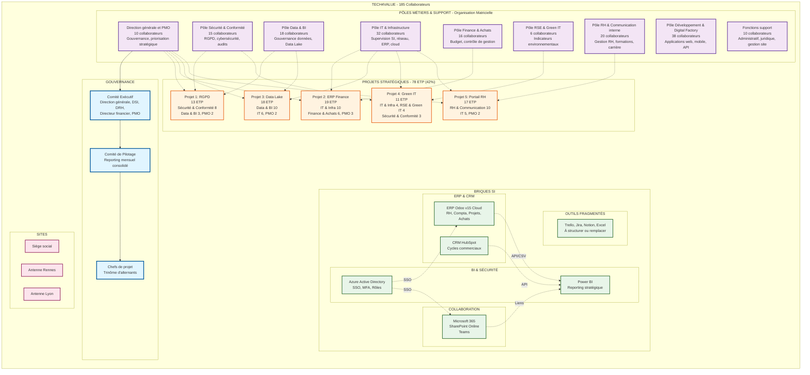

# Cartographie de l'entreprise Tech4Value

> Représentation visuelle de l'organisation matricielle de Tech4Value avec ses 185 collaborateurs, 9 pôles métiers, 5 projets stratégiques et son écosystème SI.

## Vue d'ensemble

Ce schéma présente :
- **Gouvernance** : Structure de décision (Comex, Copil, Chefs de projet)
- **Pôles métiers et support** : 9 départements avec effectifs et missions
- **Projets stratégiques** : 5 projets mobilisant 78 ETP (42% des effectifs)
- **Briques SI** : Écosystème d'outils (ERP, CRM, BI, collaboration)
- **Sites géographiques** : Siège + 2 antennes régionales

---

## Schéma Mermaid

---

## Légende des couleurs

- **Bleu clair** : Gouvernance (Comex, Copil, Chefs de projet)
- **Violet** : Pôles métiers et fonctions support
- **Orange** : Projets stratégiques en cours
- **Vert** : Briques SI et outils techniques
- **Rose** : Implantations géographiques

## Relations

- **Flèches pleines** (→) : Hiérarchie et reporting
- **Flèches pointillées** (-.→) : Contributions et intégrations

---

## Détail des effectifs par pôle

| Pôle | Effectif | Missions principales |
|------|----------|---------------------|
| Direction générale et PMO | 10 | Gouvernance, priorisation stratégique, reporting exécutif |
| Pôle IT & Infrastructure | 32 | Supervision SI, réseau, ERP, cloud, sécurité opérationnelle |
| Pôle Data & BI | 18 | Gouvernance de la donnée, développement Data Lake, reporting groupe |
| Pôle Développement & Digital Factory | 38 | Développement d'applications internes et clients (web, mobile, API) |
| Pôle Sécurité & Conformité | 15 | RGPD, cybersécurité, gestion des audits et conformité SI |
| Pôle RH & Communication interne | 20 | Gestion RH, formations, carrière, communication corporate |
| Pôle Finance & Achats | 16 | Gestion budgétaire, contrôle de gestion, contractualisation fournisseurs |
| Pôle RSE & Green IT | 6 | Suivi des indicateurs environnementaux, gouvernance durable du cloud |
| Fonctions support | 10 | Support administratif, juridique, gestion de site |
| **Total** | **185** | **collaborateurs** |

## Répartition des projets stratégiques

| Projet | Pôles impliqués | ETP dédiés | Détails |
|--------|----------------|------------|---------|
| Projet 1 - RGPD | Sécurité & Conformité (8), Data & BI (3), PMO (2) | 13 | Équipe pluridisciplinaire orientée conformité |
| Projet 2 - ERP Finance | IT & Infra (10), Finance & Achats (6), PMO (3) | 19 | Projet critique piloté par la direction financière |
| Projet 3 - Data Lake & BI | Data & BI (10), IT (6), PMO (2) | 18 | Projet transverse de gouvernance des données |
| Projet 4 - Green IT | IT & Infra (4), RSE & Green IT (4), Sécurité (3) | 11 | Équipe technique et environnementale |
| Projet 5 - Portail RH | RH & Communication (10), IT (5), PMO (2) | 17 | Pilotage RH et interconnexion SIRH |
| **Total** | - | **78 ETP** | **42% des effectifs** |

## Écosystème SI

### Outils principaux
- **ERP Odoo v15 Cloud** : RH, Comptabilité, Projets, Achats
- **CRM HubSpot** : Gestion des cycles commerciaux et opportunités
- **Microsoft 365 + SharePoint** : Collaboration et gestion documentaire
- **Power BI** : Reporting stratégique et tableaux de bord
- **Azure Active Directory** : Authentification SSO, MFA, gestion des rôles

### Outils fragmentés à structurer
- Trello (Kanban projet)
- Jira (Suivi Agile)
- Notion (Documentation)
- Excel (Gantt, budgets)

---

## Source

Document source : `cdc-annexe-2025.pdf` - État des lieux des briques SI Tech4Value

Projet d'étude M2 CPIT 2025
