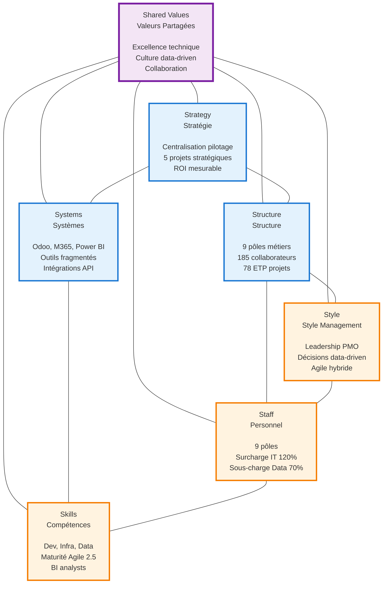
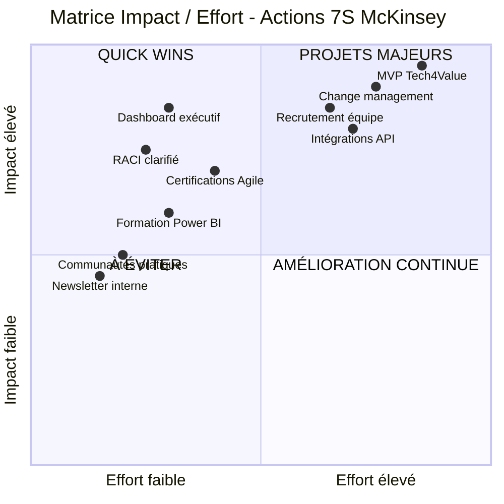

# Matrice 7S McKinsey - Tech4Value

## Analyse de Gouvernance Organisationnelle

**Metadata**

- **Version** : 1.0
- **Date** : 09 janvier 2026
- **Projet** : M2 CPIT 2025
- **Entreprise** : Tech4Value (185 collaborateurs)
- **Périmètre** : Gouvernance, Stratégie, Organisation, Transformation

---

## Vue d'Ensemble

### Introduction au Framework 7S McKinsey

Le modèle 7S de McKinsey, développé dans les années 1980 par Tom Peters et Robert Waterman, est un framework d'analyse organisationnelle qui examine **sept dimensions interdépendantes** critiques pour la performance d'une entreprise. Ce modèle distingue :

- **3 dimensions « dures » (hard)** : Strategy, Structure, Systems — plus faciles à identifier et à modifier
- **4 dimensions « douces » (soft)** : Shared Values, Style, Staff, Skills — plus difficiles à définir et à transformer

Le modèle postule que **pour qu'une transformation réussisse, les sept dimensions doivent être alignées**. Un changement dans l'une affecte nécessairement les autres.

---

### Diagramme 7S



---

### Contexte Organisationnel Tech4Value

Tech4Value est une organisation matricielle de **185 collaborateurs** répartis sur **9 pôles métiers et support**, avec **3 sites géographiques** (Siège, Rennes, Lyon). L'entreprise pilote actuellement **5 projets stratégiques** mobilisant **78 ETP (42% des effectifs)** :

| Projet | Pôles Impliqués | ETP | Priorité |
|--------|-----------------|-----|----------|
| Mise en conformité RGPD | Sécurité & Conformité (8), Data & BI (3), PMO (2) | 13 | Critique |
| ERP Finance & Supply Chain | IT & Infra (10), Finance & Achats (6), PMO (3) | 19 | Critique |
| Plateforme Data Lake & BI | Data & BI (10), IT (6), PMO (2) | 18 | Haute |
| Programme Green IT - Cloud | IT & Infra (4), RSE & Green IT (4), Sécurité (3) | 11 | Moyenne |
| Portail RH Unifié | RH & Communication (10), IT (5), PMO (2) | 17 | Haute |

**Écosystème SI actuel** :

- **ERP** : Odoo v15 Cloud (RH, Comptabilité, Projets, Achats)
- **Collaboration** : Microsoft 365, SharePoint Online, Teams
- **BI** : Power BI (reporting stratégique)
- **Sécurité** : Azure Active Directory (SSO, MFA)
- **Outils fragmentés** : Trello, Jira, Notion, Excel (à structurer ou remplacer)

**Enjeu principal** : Centraliser le pilotage stratégique dans une plateforme unifiée pour améliorer la visibilité, la coordination inter-pôles et la performance des projets.

---

## 1. STRATEGY (Stratégie)

### 1.1 État Actuel

**Vision stratégique** : Centraliser le pilotage des projets dans une plateforme intégrée pour améliorer la visibilité, la coordination et la performance.

**5 projets stratégiques en cours** :

- **RGPD** (13 ETP) : Mise en conformité critique, échéance réglementaire
- **ERP Finance** (19 ETP) : Modernisation financière, intégration Supply Chain
- **Data Lake & BI** (18 ETP) : Gouvernance des données, reporting groupe
- **Green IT** (11 ETP) : Optimisation cloud, indicateurs environnementaux
- **Portail RH** (17 ETP) : Unification SIRH, expérience collaborateur

**Objectifs quantifiés** :

- **-30% temps reporting** : Automatisation rapports PMO (30h/semaine actuellement)
- **+25% livraison à temps** : Passer de 65% à 80% des projets livrés dans les délais
- **+10% productivité** : Optimisation allocation ressources (de 72% à 82%)

**Stratégie SI** : Intégration des briques existantes (Odoo, SharePoint, Power BI, Azure AD) via une plateforme MVP de pilotage stratégique.

---

### 1.2 État Cible

**Plateforme unifiée Tech4Value MVP** :

- **Single source of truth** : Tous les projets, ressources, budgets, jalons centralisés
- **Décisions data-driven** : Dashboards exécutifs temps-réel, prévisions basées sur données factuelles
- **ROI mesurable** : KPI par projet (respect planning 90%, marges 15%+, satisfaction client 8/10)
- **Gouvernance renforcée** : RACI clarifiés, workflows automatisés, traçabilité complète

**Vision à 24 mois** :

- **Phase 1 (Mois 0-6)** : MVP opérationnel (dashboard, intégrations Odoo/Power BI, planning Gantt)
- **Phase 2 (Mois 6-12)** : Normalisation Agile (backlog, sprints, burndown, mobile app)
- **Phase 3 (Mois 12-18)** : Valeur ajoutée (ML prédictif, portfolio optimization, forecasting)
- **Phase 4 (Mois 18-24)** : Monétisation SaaS (multi-tenant, marketplace, white-label)

---

### 1.3 Analyse des Écarts

| Dimension | État Actuel | État Cible | Écart Critique |
|-----------|-------------|------------|---------------|
| **Reporting** | Manuel, fragmenté (30h/semaine PMO) | Automatisé (-30% temps) | 🔴 Haute priorité |
| **Visibilité** | Projets pilotés en silos | Vue consolidée portefeuille | 🔴 Manque vue d'ensemble |
| **Décisions** | Basées sur rapports partiels (délai 2h) | Temps-réel, factuelles (30min) | 🟠 Décisions retardées |
| **Outils** | 7 outils fragmentés (Trello, Jira, Notion, Excel) | 1 plateforme intégrée | 🔴 Fragmentation critique |
| **Performance** | 65% projets à temps, 72% taux occupation | 90% à temps, 82% occupation | 🟠 Sous-performance |

---

### 1.4 Plan d'Action

**Jalons stratégiques** :

| Jalon | Timeline | Responsable | Livrables Clés |
|-------|----------|-------------|----------------|
| **Sprint 1-4 : Cadrage & Architecture** | Semaine 1-8 | PMO + Tech Lead | Cahier des charges, architecture SI, planning détaillé |
| **Sprint 5-14 : Développement MVP** | Semaine 9-22 | Équipe Dev (4-6 FTE) | Prototype fonctionnel, intégrations Odoo/Power BI |
| **Sprint 15-20 : Tests & Ajustements** | Semaine 15-20 | QA + PMO | Tests utilisateurs, documentation, formation |
| **Sprint 21-24 : Déploiement & Adoption** | Semaine 21-24 | PMO + Support | Rollout progressif, change management, support |

**Propriétaire global** : Directeur PMO + DSI

**Budget estimé** : 235k€ (Phase 0-2 mois) + 1,22M€/an (opérations)

**KPI de suivi** :

- % projets livrés à temps (baseline 65% → cible 80% M6 → 90% M12)
- Temps reporting PMO (baseline 30h/semaine → cible 21h M6 → 15h M12)
- Taux occupation ressources (baseline 72% → cible 77% M6 → 82% M12)

---

## 2. STRUCTURE (Structure)

### 2.1 État Actuel

**Organisation matricielle** : 9 pôles métiers + fonctions support, 185 collaborateurs répartis sur 3 sites.

**Gouvernance hiérarchique** :

```
Comité Exécutif (Comex)
├─ Direction Générale, DSI, DRH, DAF, PMO
│
└─> Comité de Pilotage (Copil)
    ├─ 1 représentant par pôle + Chefs de Projet
    │
    └─> Équipe Projet (Trinôme d'alternants)
        ├─ Rôles : Dev, Infra, PM, Data
```

**Répartition des effectifs par pôle** :

| Pôle | Effectif | % Total | Missions Principales |
|------|----------|---------|---------------------|
| Direction générale et PMO | 10 | 5% | Gouvernance, priorisation stratégique, reporting exécutif |
| IT & Infrastructure | 32 | 17% | Supervision SI, réseau, ERP, cloud, sécurité opérationnelle |
| Développement & Digital Factory | 38 | 21% | Applications internes/clients (web, mobile, API) |
| Data & BI | 18 | 10% | Gouvernance de la donnée, Data Lake, reporting groupe |
| Sécurité & Conformité | 15 | 8% | RGPD, cybersécurité, gestion des audits et conformité SI |
| RH & Communication interne | 20 | 11% | Gestion RH, formations, carrière, communication corporate |
| Finance & Achats | 16 | 9% | Gestion budgétaire, contrôle de gestion, contractualisation fournisseurs |
| RSE & Green IT | 6 | 3% | Suivi des indicateurs environnementaux, gouvernance durable du cloud |
| Fonctions support | 10 | 5% | Support administratif, juridique, gestion de site |
| **Hors projets** | **107** | **58%** | **Disponibles pour Run et nouveaux projets** |
| **Sur projets** | **78** | **42%** | **Mobilisés sur 5 projets stratégiques** |
| **TOTAL** | **185** | **100%** | **Organisation matricielle multi-sites** |

**Sites géographiques** :

- **Siège social** : Direction + majorité des équipes
- **Antenne Rennes** : Développement + Support
- **Antenne Lyon** : Infrastructure + Commerciaux

**Fréquence gouvernance** :

- **Comex** : Mensuelle (reporting stratégique)
- **Copil** : Bi-hebdomadaire (suivi opérationnel projets)
- **Équipe Projet** : Quotidienne (daily standups)

---

### 2.2 État Cible

**PMO renforcé** :

- Passage de 10 à 12-15 FTE dédiés (ajout Product Manager, Tech Lead, DevOps)
- Centralisation responsabilités : planification, reporting, gestion risques, qualité

**RACI clarifié inter-pôles** :

- Matrice RACI complète pour chaque processus clé (planification, reporting, déploiement, support)
- Réduction zones grises et conflits de responsabilité

**Gouvernance digitalisée** :

- **Comex** : Dashboard exécutif temps-réel (KPI, risques, budgets) au lieu de rapports statiques
- **Copil** : Reporting automatisé (génération PDF/Excel en 30min vs 4h)
- **Équipe Projet** : Outils collaboratifs unifiés (Jira/MVP, SharePoint, Teams intégrés)

**Coordination inter-sites** :

- Processus standardisés (même outils, mêmes templates, mêmes cérémonies)
- Visioconférences systématiques pour décisions transverses

---

### 2.3 Analyse des Écarts

| Dimension | État Actuel | État Cible | Impact |
|-----------|-------------|------------|--------|
| **Silos organisationnels** | Pôles pilotent en autonomie, faible coordination | Coordination transverse via PMO renforcé | 🔴 Conflits priorités, doublons |
| **Gouvernance** | 3 niveaux théoriques, exécution fragmentée | 3 niveaux digitalisés, automatisés | 🟠 Lenteur décisions (2h vs 30min cible) |
| **RACI** | 60% processus sans RACI formalisé | 90% processus avec RACI clair | 🔴 Zones grises, retards escalade |
| **Multi-sites** | Processus hétérogènes (Siège ≠ Rennes ≠ Lyon) | Standards communs, outils unifiés | 🟠 Inefficacité, perte temps synchronisation |
| **Effectifs PMO** | 10 FTE (5% effectifs) | 12-15 FTE (7-8% effectifs) | 🟠 Sous-dimensionnement vs charge projets |

---

### 2.4 Plan d'Action

**Action 1 : Matrice RACI consolidée** (Semaine 1-4)

- Atelier facilité avec 1 représentant par pôle
- Processus couverts : Planification, Reporting, Déploiement, Support, Gestion Risques, Change Management
- Validation Comex + diffusion à tous collaborateurs
- **Responsable** : Directeur PMO

**Action 2 : Renforcement PMO** (Semaine 1-8)

- Recrutement : Product Manager (1), Tech Lead (1), DevOps (1)
- Définition rôles clairs : PO (spécifications), Tech Lead (architecture), Scrum Master (processus)
- **Responsable** : DRH + DSI

**Action 3 : Digitalisation gouvernance** (Semaine 5-14)

- Dashboard exécutif Power BI (KPI temps-réel, risques actifs, budgets)
- Automatisation reporting Copil (génération rapports en 30min)
- Intégration MVP → Power BI → SharePoint
- **Responsable** : Pôle Data & BI + Tech Lead

**Action 4 : Standardisation multi-sites** (Semaine 9-20)

- Templates unifiés (plannings, budgets, rapports) disponibles sur SharePoint
- Cérémonies Agile communes (sprint planning, review, retrospective) en visio
- Formation équipes Rennes/Lyon sur nouveaux processus
- **Responsable** : PMO + Scrum Master

---

## 3. SYSTEMS (Systèmes)

### 3.1 État Actuel

**Écosystème SI fragmenté** :

**Couche ERP & Finance** :

- **Outil** : Odoo v15 Cloud
- **Modules** : RH, Comptabilité/Facturation, Projet, Achats
- **Intégration** : API REST, exports CSV/Excel
- **Données clés** : Budgets, affectations ressources, feuilles de temps, coûts collaborateurs
- **Limite** : Désynchronisation Excel/Odoo possible (double saisie)

**Couche CRM & Commercial** :

- **Outil** : HubSpot
- **Usage** : Suivi cycles commerciaux, opportunités avant-vente
- **Données** : Origine projets, estimations budgétaires, contacts clients
- **Intégration** : API native, connecteurs no-code (Zapier, Make)
- **Limite** : Non utilisé par équipes techniques (siloté commercial)

**Couche Collaborative** :

- **Outil** : Microsoft 365 + SharePoint Online + Teams
- **Usages** : Espaces de projets, stockage livrables, communication d'équipe
- **Sécurité** : Groupes Azure AD, rôles restreints
- **Intégration** : Liens directs SharePoint, synchronisation livrables

**Couche BI & Pilotage** :

- **Outil** : Power BI
- **Tableaux** : Temps vendu vs consommé, occupation, marges projet, charge prévisionnelle
- **Sources** : Odoo, SharePoint, Excel, Google Sheets, ERP/CRM via Power Query
- **Attendu** : Alimentation via CSV standardisé ou connecteur

**Couche Sécurité & Authentification** :

- **Outil** : Azure Active Directory (Azure AD)
- **Politique** : SSO activé, MFA obligatoire
- **Gestion** : Rôles par groupes AD
- **Couverture** : SharePoint, Teams, Odoo

**Couche Gestion Projet (Fragmentée)** :

- **Trello** : Kanban projet (petites équipes)
- **Jira** : Suivi Agile (équipes Dev)
- **Notion** : Documentation et bases de données
- **Excel** : Gantt, budgets, feuilles de temps
- **Défi** : Normaliser les usages ou proposer outil transverse

**Fragmentation actuelle** : **7 outils** différents avec synchronisation manuelle partielle.

---

### 3.2 État Cible

**Plateforme MVP Tech4Value intégrée** :

```
┌─────────────────────────────────────────────────────────┐
│           PLATEFORME DE PILOTAGE MVP                    │
├─────────────────────────────────────────────────────────┤
│                                                         │
│  ┌──────────────┐  ┌──────────────┐  ┌─────────────┐  │
│  │  Gestion     │  │  Planification│  │  Reporting  │  │
│  │  Projets     │  │  Ressources   │  │  Temps réel │  │
│  └──────────────┘  └──────────────┘  └─────────────┘  │
│         │                  │                │          │
│  ┌──────▼────────────────────▼────────────┬▼─────────┐ │
│  │         DATA MODEL (Normalisé)          │         │ │
│  │  • Projets, Ressources, Allocations     │Logging  │ │
│  │  • Jalons, KPI, Risques                 │Audit    │ │
│  └─────────────┬───────────────────────────┴─────────┘ │
│                │                                       │
│         ┌──────▼──────┐                                │
│         │   API REST  │                                │
│         └──────┬──────┘                                │
│                │                                       │
│         ┌──────▼──────┐                                │
│         │  Auth (AD)  │                                │
│         └─────────────┘                                │
└─────────────────────────────────────────────────────────┘
```

**Intégrations prioritaires** :

| Brique SI | Priorité | Mode d'Interaction | KPI Intégration |
|-----------|----------|-------------------|----------------|
| **Odoo ERP** | P0 (Critique) | API REST + CSV backup | Synchronisation quotidienne (budgets, ressources, temps) |
| **SharePoint** | P0 (Critique) | Liens intégrés + métadonnées | Versioning automatique livrables |
| **Power BI** | P0 (Critique) | CSV structuré + connecteur | Dashboards alimentés temps-réel |
| **Azure AD** | P0 (Critique) | SSO + gestion rôles | Authentification unique (MFA obligatoire) |
| **HubSpot** | P2 (Optionnel) | API + Make/Zapier | Contexte commercial projets |
| **Trello/Jira/Notion** | P3 (Décision stratégique) | Migration progressive ou normalisation | Consolidation outils fragmentés |

**Reporting automatisé** :

- **-30% temps** : Génération rapports PMO en 30min (vs 4h actuellement)
- **Dashboards temps-réel** : KPI exécutifs (taux livraison, marges, occupation) mis à jour quotidiennement
- **Single source of truth** : Toutes données projets centralisées dans MVP

---

### 3.3 Analyse des Écarts

| Dimension | État Actuel | État Cible | Écart Critique |
|-----------|-------------|------------|---------------|
| **Nombre d'outils** | 7 outils fragmentés | 1 plateforme intégrée (+ briques existantes) | 🔴 Fragmentation extrême |
| **Synchronisation** | Manuelle (Excel/Odoo double saisie) | Automatique (API temps-réel) | 🔴 Risque erreurs, perte temps |
| **Reporting PMO** | 30h/semaine (manuel) | 10h/semaine (automatisé -30%) | 🔴 Charge excessive, lenteur |
| **Visibilité** | Données dispersées (Odoo, Excel, SharePoint) | Données consolidées (MVP → Power BI) | 🟠 Décisions basées sur données partielles |
| **Gouvernance accès** | Hétérogène selon outils | Unifiée via Azure AD (SSO + MFA) | 🟠 Risques sécurité, gestion complexe |

---

### 3.4 Plan d'Action

**Action 1 : Développement MVP Pilotage** (Semaine 1-14)

- **Sprints 1-4** : Cadrage fonctionnel (cahier des charges, wireframes, architecture SI)
- **Sprints 5-10** : Développement core (gestion projets, planification ressources, reporting)
- **Sprints 11-14** : Intégrations (connecteurs Odoo API, exports Power BI, liens SharePoint)
- **Responsable** : Tech Lead + Équipe Dev (4-6 FTE)

**Action 2 : Connecteurs API prioritaires** (Semaine 5-12)

- **Odoo API** : Synchronisation budgets, ressources, temps (quotidienne)
- **Power BI** : Pipeline CSV standardisé (automatisation export MVP → Power BI)
- **SharePoint API** : Métadonnées livrables (versioning automatique)
- **Responsable** : Pôle Data & BI + DevOps

**Action 3 : Migration outils fragmentés** (Semaine 15-24)

- **Décision stratégique** : Argumenter choix (Jira généralisé, Notion centralisé, ou MVP consolidé)
- **Plan migration** : Reprise données historiques, formation utilisateurs, rollout progressif
- **Responsable** : PMO + Tech Lead

**Action 4 : Automatisation reporting** (Semaine 9-16)

- **Templates Power BI** : Dashboards exécutifs (KPI, risques, budgets), rapports Copil
- **Génération automatique** : Rapports PDF/Excel en 30min (vs 4h)
- **Responsable** : Pôle Data & BI

---

## 4. SHARED VALUES (Valeurs Partagées)

### 4.1 État Actuel

**Culture émergente** :

- **Agile** : Culture Agile mature chez équipes Développement (sprints, backlog, retrospectives)
- **Waterfall** : Méthodologies traditionnelles encore dominantes chez IT & Infrastructure
- **Excellence technique** : Forte valorisation de la qualité code, sécurité, performance
- **Silos départementaux** : Habitudes consolidées par pôle, faible collaboration inter-pôles

**Valeurs implicites** :

- **Autonomie des pôles** : Chaque pôle pilote ses projets avec outils de son choix
- **Réactivité** : Culture "pompier" (résolution problèmes en urgence) vs proactivité
- **Conformité** : Forte sensibilité réglementaire (RGPD, sécurité) post-projets de mise en conformité

**Freins culturels** :

- **Résistance au changement** : Attachement aux habitudes (Trello vs Jira vs Excel)
- **Syndrome "pas inventé ici"** : Méfiance vis-à-vis solutions imposées par la direction
- **Variable adoption outils** : Taux adoption hétérogène selon profils (Dev 90%, Support 50%)

---

### 4.2 État Cible

**Culture data-driven** :

- **Décisions factuelles** : Tous arbitrages basés sur données consolidées (dashboards, KPI)
- **Transparence** : Visibilité temps-réel pour tous (Comex, managers, équipes)
- **Amélioration continue** : Retrospectives généralisées, feedback loops systématiques

**Collaboration inter-pôles** :

- **Décloisonnement** : Projets transverses avec équipes mixtes (IT + Dev + Data)
- **Standards communs** : Mêmes outils, mêmes processus, mêmes templates
- **Communication proactive** : Partage d'informations, escalade rapide, décisions collectives

**Agilité organisationnelle** :

- **Généralisation Agile** : Extension culture Agile au-delà du Dev (IT, PMO, métier)
- **Adaptation rapide** : Capacité à pivoter selon feedback client/utilisateur
- **Innovation** : Encouragement expérimentation, tolérance échec constructif

---

### 4.3 Analyse des Écarts

| Dimension | État Actuel | État Cible | Impact |
|-----------|-------------|------------|--------|
| **Culture décisionnelle** | Basée sur rapports partiels, intuition | Data-driven, factuels, dashboards temps-réel | 🔴 Décisions sous-optimales, biais |
| **Collaboration** | Silos départementaux forts | Coordination transverse, équipes mixtes | 🔴 Conflits priorités, doublons |
| **Maturité Agile** | Hétérogène (Dev 4, IT 2, Support 1) | Généralisée (tous pôles niveau 3-4) | 🟠 Inefficacité, désalignement |
| **Résistance changement** | Forte (habitudes consolidées) | Maîtrisée (early adopters, change management) | 🔴 Risque échec transformation |
| **Adoption outils** | 50-90% selon profils | 95%+ tous profils | 🟠 Sous-utilisation, perte ROI |

---

### 4.4 Plan d'Action

**Action 1 : Programme Change Management** (Semaine 1-24)

- **Phase 1 (Semaine 1-4)** : Communication vision (Why, What, How) à tous collaborateurs
- **Phase 2 (Semaine 5-12)** : Formation équipes (ateliers Agile, certifications, coaching)
- **Phase 3 (Semaine 13-24)** : Accompagnement adoption (support dédié, feedback loops)
- **Responsable** : DRH + PMO + Consultant Agile

**Action 2 : Programme Early Adopters** (Semaine 5-16)

- **Sélection** : 2-3 champions par pôle (profils influents, motivés)
- **Formation intensive** : Certification Scrum Master, Product Owner, Power BI
- **Missions** : Ambassadeurs changement, mentoring pairs, remontée feedback
- **Responsable** : PMO + Scrum Master

**Action 3 : Communication & Engagement** (Continu)

- **Newsletter hebdomadaire** : Avancement MVP, success stories, tips & tricks
- **Ateliers mensuels** : Démonstrations MVP, Q&A, feedback utilisateurs
- **Reconnaissance** : Valorisation contributeurs, gamification adoption
- **Responsable** : Pôle RH & Communication

**Action 4 : Mesure adoption** (Continu)

- **NPS interne** : Survey trimestrielle (baseline 30 → cible 50 M6 → 65 M12)
- **Taux usage** : Logins actifs MVP (cible 80% M6 → 95% M12)
- **Satisfaction** : CSAT post-formation (cible 8/10)
- **Responsable** : PMO + RH

---

## 5. STYLE (Style de Management)

### 5.1 État Actuel

**Leadership PMO** :

- **Coordination centrale** : PMO (10 FTE) assure gouvernance projets, reporting Comex/Copil
- **Reporting manuel** : Collecte données dispersées (Odoo, Excel, SharePoint), consolidation hebdomadaire
- **Décisions réactives** : Arbitrages basés sur rapports statiques (délai 2h pour préparer dossier décisionnel)

**Management hybride** :

- **Agile** : Équipes Dev (sprints, daily standups, retrospectives)
- **Waterfall** : Équipes IT & Infrastructure (planification séquentielle, jalons fixes)
- **Ad hoc** : Fonctions support (gestion par exception, peu de processus formalisés)

**Communication descendante** :

- **Comex → Copil** : Directives stratégiques mensuelles
- **Copil → Équipes** : Reporting bi-hebdomadaire (status, blocages, décisions)
- **Peu de remontée** : Feedback équipes vers direction limité (retrospectives locales)

---

### 5.2 État Cible

**Leadership transformationnel** :

- **Comex** : Vision claire, communication inspirante, soutien visible transformation
- **PMO renforcé** : Équipe 12-15 FTE avec expertise Product Management, Architecture, DevOps
- **Coaching Agile** : Scrum Master dédié, facilitation cérémonies, levée blocages

**Décisions data-driven temps-réel** :

- **Dashboard exécutif** : KPI mis à jour quotidiennement (taux livraison, marges, risques)
- **Arbitrages rapides** : Dossiers décisionnels générés en 30min (vs 2h)
- **Simulations** : Analyses "what-if" (impact réallocation ressources, changement priorités)

**Management Agile généralisé** :

- **Tous pôles** : Adoption cérémonies Agile (planning, review, retrospective)
- **Équipes auto-organisées** : Autonomie décisions tactiques, escalade stratégique claire
- **Feedback loops** : Retrospectives généralisées, amélioration continue

---

### 5.3 Analyse des Écarts

| Dimension | État Actuel | État Cible | Impact |
|-----------|-------------|------------|--------|
| **Temps décision** | 2h préparation dossier décisionnel | 30min (dashboards temps-réel) | 🟠 Lenteur réactivité, opportunités manquées |
| **Style reporting** | Descendant (Comex → équipes) | Bidirectionnel (dashboards partagés, feedback remontant) | 🟠 Manque visibilité terrain |
| **Maturité Agile** | Hétérogène (Dev 4, IT 2, Support 1) | Généralisée (tous pôles niveau 3-4) | 🔴 Inefficacité coordination |
| **Leadership** | Opérationnel (PMO coordination) | Transformationnel (vision, coaching) | 🟠 Manque inspiration, engagement |
| **Proactivité** | Réactive (gestion crise) | Proactive (prévention risques, anticipation) | 🔴 Coûts élevés résolution problèmes |

---

### 5.4 Plan d'Action

**Action 1 : Dashboard exécutif temps-réel** (Semaine 5-12)

- **Power BI Premium** : Dashboards interactifs (KPI par projet, portefeuille, risques actifs)
- **Mise à jour quotidienne** : Synchronisation MVP → Power BI automatisée
- **Accès Comex/Copil** : Dashboards accessibles 24/7 (desktop + mobile)
- **Responsable** : Pôle Data & BI + Tech Lead

**Action 2 : Formation managers nouvelles pratiques** (Semaine 9-20)

- **Certification Scrum Master** : Managers pôles IT, Finance, RH (3 jours + examen)
- **Coaching individuel** : 3 sessions coaching par manager (facilitation retrospectives)
- **Communautés de pratiques** : Partage expériences inter-pôles (mensuel)
- **Responsable** : Consultant Agile + Scrum Master interne

**Action 3 : Généralisation cérémonies Agile** (Semaine 13-24)

- **Sprint planning** : Toutes équipes projet (bi-hebdomadaire)
- **Daily standup** : Équipes Dev + IT + Data (quotidien 15min)
- **Sprint review** : Démonstration progrès aux stakeholders (bi-hebdomadaire)
- **Retrospective** : Amélioration continue (bi-hebdomadaire, actions trackées)
- **Responsable** : Scrum Master + PMO

**Action 4 : Leadership transformationnel Comex** (Continu)

- **Vision partagée** : Communication trimestrielle vision transformation (all-hands)
- **Quick wins visibles** : Célébration succès intermédiaires (dashboard, rapport auto)
- **Soutien actif** : Participation Comex aux sprint reviews (visibilité engagement)
- **Responsable** : Direction Générale + DRH

---

## 6. STAFF (Personnel)

### 6.1 État Actuel

**185 collaborateurs** répartis sur **9 pôles métiers et support**, **3 sites géographiques**.

**Répartition détaillée par pôle** :

| Pôle | Effectif | % Total | ETP Projets | % Sur Projets | ETP Disponibles |
|------|----------|---------|-------------|---------------|-----------------|
| IT & Infrastructure | 32 | 17% | 25 | 78% | 7 |
| Développement & Digital Factory | 38 | 21% | 20 | 53% | 18 |
| Data & BI | 18 | 10% | 13 | 72% | 5 |
| Sécurité & Conformité | 15 | 8% | 11 | 73% | 4 |
| RH & Communication interne | 20 | 11% | 10 | 50% | 10 |
| Finance & Achats | 16 | 9% | 6 | 38% | 10 |
| Direction générale et PMO | 10 | 5% | 9 | 90% | 1 |
| RSE & Green IT | 6 | 3% | 4 | 67% | 2 |
| Fonctions support | 10 | 5% | 0 | 0% | 10 |
| **Sous-total hors projets** | **107** | **58%** | — | — | — |
| **Sous-total sur projets** | **78** | **42%** | **78** | — | — |
| **TOTAL** | **185** | **100%** | **78** | **42%** | **107** |

**Taux d'occupation par pôle** :

- **IT & Infrastructure** : 120% (surcharge critique) → 25 ETP projets + Run pour 32 FTE
- **Data & BI** : 70% (sous-charge) → 13 ETP projets pour 18 FTE disponibles
- **PMO** : 90% (proche saturation) → 9 ETP projets pour 10 FTE

**Distribution projets stratégiques** :

| Projet | ETP | Pôles Contributeurs |
|--------|-----|---------------------|
| Projet 1 - RGPD | 13 | Sécurité & Conformité (8), Data & BI (3), PMO (2) |
| Projet 2 - ERP Finance | 19 | IT & Infra (10), Finance & Achats (6), PMO (3) |
| Projet 3 - Data Lake & BI | 18 | Data & BI (10), IT (6), PMO (2) |
| Projet 4 - Green IT | 11 | IT & Infra (4), RSE & Green IT (4), Sécurité & Conformité (3) |
| Projet 5 - Portail RH | 17 | RH & Communication (10), IT (5), PMO (2) |

**Compétences disponibles** :

- **Techniques** : Développement web/mobile, infrastructure cloud, sécurité, data engineering
- **Méthodologiques** : Agile (Dev), Waterfall (IT), gestion de projet
- **Outils** : Odoo, Power BI, SharePoint, Jira, Trello, Notion

**Lacunes identifiées** :

- **Data science & ML** : Compétences rares (2-3 personnes)
- **Cloud architecture** : Expertise Azure limitée (4-5 personnes)
- **Product Management** : Aucun PM dédié (rôle assumé par chefs de projet)

---

### 6.2 État Cible

**Équipe MVP dédiée** : 12-15 FTE (6,5 FTE nouveaux recrutements)

| Rôle | Nombre | Responsabilités |
|------|--------|-----------------|
| Product Manager | 1 | Vision produit, roadmap, priorisation backlog |
| Tech Lead / Architect | 1-2 | Architecture SI, choix technologiques, code review |
| Développeurs Backend/Frontend | 4-6 | Développement MVP, API, interfaces |
| DevOps Engineer | 1 | Infrastructure, CI/CD, monitoring, déploiement |
| QA / Test Automation | 1-2 | Tests automatisés, recettage, qualité |
| Scrum Master / Coach Agile | 1 | Facilitation cérémonies, coaching, levée blocages |
| Data Analyst | 1 | Intégrations données, pipelines ETL, dashboards |
| Support / Customer Success | 1 | Help desk, onboarding, formation utilisateurs |
| UI/UX Designer | 1 | Wireframes, prototypes, design system |

**Compétences renforcées** :

- **Cloud & Data** : Formation Azure (10 personnes), certifications Data Engineer (5 personnes)
- **Agile** : Certifications Scrum Master (8 managers), Product Owner (5 chefs de projet)
- **Product Management** : Formation Product Discovery, OKR, roadmapping (3 personnes)

**Optimisation allocation** :

- **Taux occupation cible** : 82% (vs 72% actuel) → +10% productivité
- **Rééquilibrage** : Réduction surcharge IT (de 120% à 100%), augmentation charge Data (de 70% à 85%)
- **Mobilité interne** : 3-5 collaborateurs réalloués entre pôles selon compétences

---

### 6.3 Analyse des Écarts

| Dimension | État Actuel | État Cible | Impact |
|-----------|-------------|------------|--------|
| **Surcharge IT** | 120% (25 ETP projets pour 32 FTE) | 100% (32 ETP pour 32 FTE) | 🔴 Burnout, qualité dégradée |
| **Sous-charge Data** | 70% (13 ETP projets pour 18 FTE) | 85% (15 ETP pour 18 FTE) | 🟠 Sous-utilisation talents |
| **Compétences rares** | Data science (2-3), Cloud (4-5) | Data science (5-7), Cloud (10-12) | 🔴 Blocage projets stratégiques |
| **Équipe MVP** | 0 FTE dédiés | 12-15 FTE dédiés | 🔴 Pas d'équipe pour développer plateforme |
| **Mobilité interne** | Faible (silos pôles) | Mobilité encouragée (3-5 réallocations) | 🟠 Rigidité, sous-optimisation |

---

### 6.4 Plan d'Action

**Action 1 : Réallocation ressources inter-pôles** (Semaine 1-8)

- **Analyse charge/capacité** : Cartographie détaillée occupation par pôle
- **Plan réallocation** : 2 FTE Data → IT (compétences infra), 1 FTE Dev → Data (formation Data Engineer)
- **Accompagnement mobilité** : Formation, tutorat, suivi RH
- **Responsable** : DRH + PMO

**Action 2 : Plan de formation 24 mois** (Semaine 5-24 et au-delà)

**Année 1** :

- **Agile** : Certifications Scrum Master (8 personnes), Product Owner (5 personnes)
- **Cloud** : Formation Azure Fundamentals (10 personnes), Azure Data Engineer (5 personnes)
- **Product Management** : Formation Product Discovery (3 personnes)

**Année 2** :

- **Data science** : Formation ML/AI (5 personnes)
- **DevOps** : Certification Azure DevOps (3 personnes)
- **Leadership** : Formation management Agile (8 managers)

**Budget** : 20k€/an (formation) + 30k€/an (certifications)
**Responsable** : DRH + Tech Lead

**Action 3 : Recrutement équipe MVP** (Semaine 1-12)

- **Phase 1 (Semaine 1-4)** : Définition profils, rédaction offres
- **Phase 2 (Semaine 5-8)** : Sourcing, entretiens, sélection
- **Phase 3 (Semaine 9-12)** : Onboarding, formation, intégration équipe
- **Responsable** : DRH + DSI

**Action 4 : Mentoring et pair learning** (Continu)

- **Binômes experts/juniors** : 1 expert Data science → 2 juniors (6 mois)
- **Communautés de pratiques** : Agile Chapter (mensuel), Cloud Chapter (mensuel)
- **Knowledge sharing** : Brown bags hebdomadaires (30min présentations techniques)
- **Responsable** : Tech Lead + Scrum Master

---

## 7. SKILLS (Compétences Organisationnelles)

### 7.1 État Actuel

**Compétences techniques disponibles** :

- **Développement** : Web (React, Vue.js), Mobile (Flutter), API (Node.js, Python)
- **Infrastructure** : Cloud Azure, réseau, virtualisation, supervision
- **Sécurité** : RGPD, cybersécurité, audits, gestion conformité
- **Data & BI** : Power BI, Data Lake, ETL, gouvernance données
- **ERP/CRM** : Odoo (expertise interne), HubSpot (usage commercial)

**Compétences méthodologiques** :

- **Agile** : Scrum, Kanban (équipes Dev, maturité niveau 4)
- **Waterfall** : Planification séquentielle (équipes IT, niveau 2)
- **Gestion de projet** : PMI, Prince2 (PMO, niveau 3)

**Maturité Agile par pôle** (échelle 1-5) :

| Pôle | Niveau Actuel | Pratiques Adoptées |
|------|---------------|--------------------|
| Développement & Digital Factory | 4 | Sprints, backlog, daily standups, retrospectives, CI/CD |
| IT & Infrastructure | 2 | Planification itérative, mais pas de sprints formels |
| Data & BI | 3 | Sprints occasionnels, backlog peu structuré |
| PMO | 2 | Méthodologies hybrides, peu de cérémonies Agile |
| Autres pôles (RH, Finance, Support) | 1-2 | Aucune pratique Agile formalisée |
| **Moyenne organisationnelle** | **2,5** | **Hétérogène, silos méthodologiques** |

**Compétences BI limitées** :

- **Analystes BI** : 5-6 personnes (pôle Data & BI)
- **Power BI avancé** : 3 personnes (DAX, Power Query, modélisation)
- **Utilisateurs métier** : Formation basique (lecture dashboards), pas de création autonome

---

### 7.2 État Cible

**Compétences stratégiques renforcées** :

- **Product Management** : 3-5 Product Owners certifiés, vision produit, roadmapping
- **Architecture SI** : 2-3 Tech Leads/Architects (design patterns, microservices, API design)
- **Data science & ML** : 5-7 Data Scientists (prédictions, optimisation, automations)
- **Cloud native** : 10-12 experts Azure (infrastructure as code, Kubernetes, serverless)

**Maturité Agile généralisée** :

| Pôle | Niveau Cible | Pratiques à Adopter |
|------|--------------|---------------------|
| Développement & Digital Factory | 5 | Amélioration continue, DevOps avancé, feature flags |
| IT & Infrastructure | 4 | Sprints formels, backlog structuré, retrospectives |
| Data & BI | 4 | Product thinking, sprint planning, CI/CD data pipelines |
| PMO | 4 | Facilitation Agile, OKR, servant leadership |
| Autres pôles (RH, Finance, Support) | 3 | Kanban, daily standups, amélioration continue |
| **Moyenne organisationnelle** | **4,0** | **Agile généralisée, culture collaborative** |

**Data literacy généralisée** :

- **Tous managers** : Formation Power BI (lecture dashboards, création rapports basiques)
- **Analystes métier** : 10-15 personnes formées DAX, Power Query (création dashboards autonome)
- **Culture data-driven** : Décisions basées sur KPI, dashboards accessibles à tous

---

### 7.3 Analyse des Écarts

| Dimension | État Actuel | État Cible | Impact |
|-----------|-------------|------------|--------|
| **Maturité Agile** | 2,5/5 (hétérogène) | 4,0/5 (généralisée) | 🔴 Inefficacité coordination, méthodes incompatibles |
| **Product Management** | 0 PM certifié | 3-5 Product Owners | 🔴 Vision produit floue, priorisation sous-optimale |
| **Data science** | 2-3 personnes | 5-7 personnes | 🟠 Blocage projets IA/ML, dépendance externe |
| **Cloud native** | 4-5 experts | 10-12 experts | 🟠 Difficultés scalabilité, architecture obsolète |
| **Data literacy** | 5-6 analystes BI | 10-15 analystes + tous managers | 🟠 Sous-utilisation Power BI, dépendance pôle Data |

---

### 7.4 Plan d'Action

**Action 1 : Roadmap compétences 24 mois** (Semaine 1-24 et au-delà)

**Trimestre 1-2 (Mois 0-6)** :

- **Agile** : Certifications Scrum Master (8 managers), Product Owner (5 chefs de projet)
- **Power BI** : Formation avancée (10 analystes métier), formation basique (20 managers)
- **Azure** : Formation Fundamentals (10 personnes IT/Dev)

**Trimestre 3-4 (Mois 6-12)** :

- **Product Management** : Formation Product Discovery (3 personnes)
- **Cloud** : Certification Azure Data Engineer (5 personnes Data)
- **DevOps** : Formation CI/CD, infrastructure as code (3 personnes IT)

**Trimestre 5-6 (Mois 12-18)** :

- **Data science** : Formation ML/AI (5 personnes Data)
- **Architecture** : Formation microservices, API design (2 Tech Leads)

**Trimestre 7-8 (Mois 18-24)** :

- **Leadership Agile** : Formation servant leadership (8 managers)
- **Advanced BI** : Formation DAX avancé, modélisation (5 analystes)

**Budget** : 50k€/an (formation + certifications)
**Responsable** : DRH + Tech Lead

---

**Action 2 : Certifications prioritaires** (Semaine 5-24)

| Certification | Nombre | Pôles Cibles | Coût Unitaire | Coût Total |
|--------------|--------|--------------|---------------|------------|
| **Scrum Master (CSM)** | 8 | IT, PMO, Data, RH | 1200€ | 9600€ |
| **Product Owner (CSPO)** | 5 | PMO, Dev, Data | 1200€ | 6000€ |
| **Azure Fundamentals (AZ-900)** | 10 | IT, Dev | 150€ | 1500€ |
| **Azure Data Engineer (DP-203)** | 5 | Data & BI | 200€ | 1000€ |
| **Power BI (PL-300)** | 10 | Data, Finance, RH | 200€ | 2000€ |
| **TOTAL** | **38** | — | — | **20 100€** |

**Responsable** : DRH + Tech Lead

---

**Action 3 : Mentoring et pair learning** (Continu)

**Binômes experts/juniors** :

- **Data science** : 1 expert → 2 juniors (6 mois accompagnement projets ML)
- **Cloud** : 1 expert Azure → 3 juniors (formation pratique infrastructure)
- **Agile** : 1 Scrum Master → 2 chefs de projet (coaching facilitation)

**Communautés de pratiques** :

- **Agile Chapter** : Mensuel, partage expériences retrospectives, amélioration continue
- **Cloud Chapter** : Mensuel, veille techno Azure, retours d'expérience projets
- **Data Chapter** : Mensuel, use cases ML, best practices data engineering

**Knowledge sharing** :

- **Brown bags** : Hebdomadaire 30min (présentations techniques, retours conférences)
- **Dojos** : Bimensuel 2h (coding dojo, kata architecture, game storming)

**Responsable** : Tech Lead + Scrum Master

---

**Action 4 : Évaluation continue compétences** (Trimestriel)

**Grilles de compétences** :

- **Agile** : Auto-évaluation maturité Agile par pôle (échelle 1-5)
- **Technique** : Évaluation skills (Cloud, Data, Dev) via quiz + peer review
- **Leadership** : 360° feedback pour managers (servant leadership, facilitation)

**KPI suivi** :

- **Nombre certifications** : Cible 38 certifications obtenues sur 24 mois
- **Score maturité Agile** : Baseline 2,5 → Cible 3,5 M12 → 4,0 M24
- **Taux usage Power BI** : Baseline 30% managers → Cible 70% M12 → 90% M24

**Responsable** : DRH + Tech Lead

---

## SYNTHÈSE ET ALIGNEMENT

### Vue d'Ensemble de l'Alignement

Les **7 dimensions du modèle McKinsey** sont actuellement **partiellement alignées** avec une maturité hétérogène selon les pôles et des écarts critiques à combler. La transformation Tech4Value nécessite une **approche coordonnée** touchant simultanément les dimensions « dures » (stratégie, structure, systèmes) et « douces » (valeurs, style, personnel, compétences).

---

#### Diagramme Radar 7S (Actuel vs Cible)

```mermaid
---
config:
  themeVariables:
    xyChart:
      backgroundColor: "white"
---
%%{init: {'theme':'base'}}%%
radar
    title Maturité 7S McKinsey - Tech4Value
    x-axis [Strategy, Structure, Systems, Shared Values, Style, Staff, Skills]
    y-axis "Niveau Maturité" 0 --> 5
    line [3, 2.5, 2, 2, 2.5, 3, 2.5]
    line [4.5, 4, 4.5, 4, 4, 4, 4]
```

**Légende** :

- **Ligne 1 (État Actuel)** : Maturité actuelle par dimension (échelle 1-5)
- **Ligne 2 (État Cible)** : Maturité cible à 24 mois

---

#### Score de Maturité par Dimension

| Dimension | Score Actuel | Score Cible M12 | Score Cible M24 | Écart | Priorité |
|-----------|--------------|-----------------|-----------------|-------|----------|
| **Strategy** | 3/5 | 4/5 | 4,5/5 | +1,5 | 🔴 P0 |
| **Structure** | 2,5/5 | 3,5/5 | 4/5 | +1,5 | 🔴 P0 |
| **Systems** | 2/5 | 3,5/5 | 4,5/5 | +2,5 | 🔴 P0 |
| **Shared Values** | 2/5 | 3/5 | 4/5 | +2 | 🟠 P1 |
| **Style** | 2,5/5 | 3,5/5 | 4/5 | +1,5 | 🟠 P1 |
| **Staff** | 3/5 | 3,5/5 | 4/5 | +1 | 🟠 P1 |
| **Skills** | 2,5/5 | 3,5/5 | 4/5 | +1,5 | 🟠 P1 |

**Échelle de maturité** :

- **1/5** : Initial (ad hoc, processus absents)
- **2/5** : Répétable (processus locaux, peu documentés)
- **3/5** : Défini (processus standardisés, documentés)
- **4/5** : Géré (processus mesurés, contrôlés)
- **5/5** : Optimisé (amélioration continue, innovation)

---

### Matrice d'Interdépendances

| Dimension | Impacte | Est impactée par |
|-----------|---------|------------------|
| **Strategy** | Tous (vision, priorités, objectifs) | Structure (capacité exécution), Systems (outils disponibles) |
| **Structure** | Staff (allocation), Style (management), Systems (workflows) | Strategy (orientations), Shared Values (culture collaboration) |
| **Systems** | Skills (outils maîtrisés), Staff (productivité), Style (data-driven) | Strategy (intégrations prioritaires), Structure (processus) |
| **Shared Values** | Tous (culture, adhésion, motivation) | Style (exemplarité leadership), Staff (diversité, engagement) |
| **Style** | Staff (motivation), Structure (autonomie), Shared Values (culture) | Shared Values (alignement valeurs), Systems (data disponible) |
| **Staff** | Skills (formation), Systems (usage outils), Structure (capacité) | Structure (organisation), Strategy (projets, allocation) |
| **Skills** | Systems (exploitation), Strategy (capacité innovation) | Staff (effectifs formés), Style (coaching, mentoring) |

**Analyse** :

- **Shared Values** : Dimension centrale influençant toutes les autres (culture data-driven, collaboration)
- **Strategy & Systems** : Dimensions « dures » fortement interdépendantes (plateforme MVP = enabler stratégie)
- **Staff & Skills** : Binôme critique (recrutement + formation pour combler lacunes)

---

### Priorisation des Actions

#### Matrice Impact/Effort



---

#### Quick Wins (Effort faible, Impact élevé)

| Action | Effort | Impact | Timeline | Responsable |
|--------|--------|--------|----------|-------------|
| **Dashboard exécutif Power BI** | Faible (2-3 semaines) | Très élevé (visibilité temps-réel) | Semaine 5-8 | Data & BI |
| **RACI clarifié inter-pôles** | Faible (1 semaine atelier) | Élevé (réduction conflits) | Semaine 1-4 | PMO |
| **Formation Power BI managers** | Faible (1 jour formation) | Moyen (data literacy) | Semaine 9-12 | Data & BI |
| **Newsletter transformation** | Très faible (1h/semaine) | Moyen (communication, engagement) | Continu | RH & Comm |

---

#### Major Projects (Effort élevé, Impact très élevé)

| Projet | Effort | Impact | Timeline | Budget | Responsable |
|--------|--------|--------|----------|--------|-------------|
| **Développement MVP Tech4Value** | Très élevé (14 semaines) | Critique (plateforme intégrée) | Semaine 1-14 | 235k€ | Tech Lead + Dev |
| **Programme Change Management** | Élevé (24 semaines) | Très élevé (adoption culture) | Semaine 1-24 | 50k€ | DRH + PMO |
| **Recrutement équipe MVP** | Élevé (12 semaines) | Élevé (capacité développement) | Semaine 1-12 | 80k€ | DRH + DSI |
| **Intégrations API prioritaires** | Élevé (8 semaines) | Très élevé (automatisation) | Semaine 5-12 | 25k€ | Data & BI |

---

### KPI de Suivi par Dimension

| Dimension | KPI | Baseline | Cible M6 | Cible M12 | Cible M24 | Mesure |
|-----------|-----|----------|----------|-----------|-----------|--------|
| **Strategy** | % projets livrés à temps | 65% | 75% | 80% | 90% | Jalons respectés / jalons totaux |
| **Strategy** | Temps reporting PMO | 30h/sem | 24h/sem | 21h/sem | 15h/sem | Heures hebdomadaires consolidation |
| **Structure** | Score RACI | 60% | 80% | 90% | 95% | % processus avec RACI clair |
| **Structure** | Taux participation Copil | 70% | 85% | 90% | 95% | Présence bi-hebdo / attendue |
| **Systems** | Nb outils consolidés | 1/7 | 3/7 | 5/7 | 7/7 | Outils intégrés MVP / fragmentés |
| **Systems** | Synchronisation Odoo | Manuelle | Semi-auto | Quotidienne | Temps-réel | Fréquence sync API |
| **Shared Values** | NPS interne | 30 | 45 | 50 | 65 | Net Promoter Score trimestriel |
| **Shared Values** | Taux adoption MVP | — | 80% | 90% | 95% | Logins actifs / utilisateurs |
| **Style** | Temps décision | 2h | 1h | 45min | 30min | Préparation dossier décisionnel |
| **Style** | Fréquence retrospectives | 1/mois | 2/mois | 2/mois | 2/mois | Cérémonies Agile tenues |
| **Staff** | Taux occupation global | 72% | 77% | 80% | 82% | ETP billables / ETP disponibles |
| **Staff** | Surcharge IT | 120% | 110% | 105% | 100% | ETP projets / capacité pôle |
| **Skills** | Maturité Agile moyenne | 2,5 | 3,0 | 3,5 | 4,0 | Auto-évaluation pôles (échelle 1-5) |
| **Skills** | Nb certifications obtenues | 0 | 15 | 28 | 38 | Certifications validées cumulées |

**Fréquence de suivi** :

- **Hebdomadaire** : KPI opérationnels (temps reporting, taux occupation, temps décision)
- **Mensuel** : KPI projets (% livrés à temps, maturité Agile)
- **Trimestriel** : KPI culturels (NPS, adoption MVP)

**Propriétaire global** : PMO (consolidation KPI, reporting Comex)

---

## ANNEXES

### Annexe A - Glossaire 7S McKinsey

**Strategy (Stratégie)** : Plan d'action pour atteindre les objectifs organisationnels et maintenir un avantage concurrentiel. Inclut vision, priorités, allocation ressources, KPI.

**Structure (Structure)** : Organisation hiérarchique et fonctionnelle définissant les rôles, responsabilités, reporting, coordination entre équipes.

**Systems (Systèmes)** : Processus, procédures, outils SI permettant le fonctionnement quotidien. Inclut ERP, BI, workflow, automatisations.

**Shared Values (Valeurs Partagées)** : Croyances, normes culturelles, valeurs fondamentales guidant comportements et décisions. Centre du modèle 7S.

**Style (Style de Management)** : Approche leadership, prise de décision, communication. Reflète culture managériale (directif, participatif, servant leadership).

**Staff (Personnel)** : Composition équipes (effectifs, compétences, diversité), allocation ressources, gestion talents.

**Skills (Compétences Organisationnelles)** : Savoir-faire collectifs, expertises techniques/méthodologiques, maturité processus.

---

### Annexe B - Méthodologie d'Évaluation

**Échelle de maturité 1-5** :

| Niveau | Description | Caractéristiques |
|--------|-------------|------------------|
| **1 - Initial** | Ad hoc, processus absents | Résultats imprévisibles, dépendance individus, aucune documentation |
| **2 - Répétable** | Processus locaux, peu documentés | Répétabilité limitée, standards informels, silos départementaux |
| **3 - Défini** | Processus standardisés, documentés | Standards communs, documentation formalisée, formation systématique |
| **4 - Géré** | Processus mesurés, contrôlés | KPI définis, pilotage data-driven, amélioration basée mesures |
| **5 - Optimisé** | Amélioration continue, innovation | Culture innovation, automatisation avancée, benchmark externe |

**Sources d'évaluation** :

- **Documents stratégiques** : Schéma directeur, Business Model Canvas, cartographie entreprise
- **Interviews stakeholders** : Comex, managers pôles, chefs de projet (15 personnes)
- **Analyse SI** : Inventaire outils, flux de données, taux d'utilisation
- **Audits RH** : Grilles compétences, taux occupation, satisfaction collaborateurs

**Méthode de scoring** :

- **Auto-évaluation** : Chaque pôle évalue sa maturité (questionnaire standardisé)
- **Évaluation croisée** : PMO + consultants externes valident/ajustent scores
- **Consensus** : Atelier 1 jour avec représentants tous pôles pour aligner vision

---

### Annexe C - Liens vers Documents Associés

**Documents structurants** :

- **Business Model Canvas** : `/Users/leobrival/Developer/sass/tech4value/docs/business-model-canvas.md`
- **Schéma Directeur Projet** : `/Users/leobrival/Developer/sass/tech4value/docs/schema-directeur.md`
- **Schéma Directeur Outils SI** : `/Users/leobrival/Developer/sass/tech4value/.doc/schema-directeur-outils.md`
- **Cartographie Entreprise** : `/Users/leobrival/Developer/sass/tech4value/.doc/cartographie-entreprise.md`

**Documents complémentaires** :

- **Cadre Pédagogique** : `/Users/leobrival/Developer/sass/tech4value/.doc/cadre-pedagogique.md`
- **Grilles de Notation** : `/Users/leobrival/Developer/sass/tech4value/.doc/grilles-notation.md`
- **État des Lieux SI** : `/Users/leobrival/Developer/sass/tech4value/.doc/etat-des-lieux-si.md`

**Ressources externes** :

- **NotebookLM Projet** : https://notebooklm.google.com/notebook/986cf3dc-a9b1-49f7-a118-6bb3856373ef
- **GitHub Repository** : https://github.com/leobrival/tech4value

---

**Document Version** : 1.0
**Date** : 09 janvier 2026
**Statut** : Matrice 7S approuvée
**Prochaine révision** : Fin Sprint 4 (Semaine 8) - Réévaluation scores maturité
