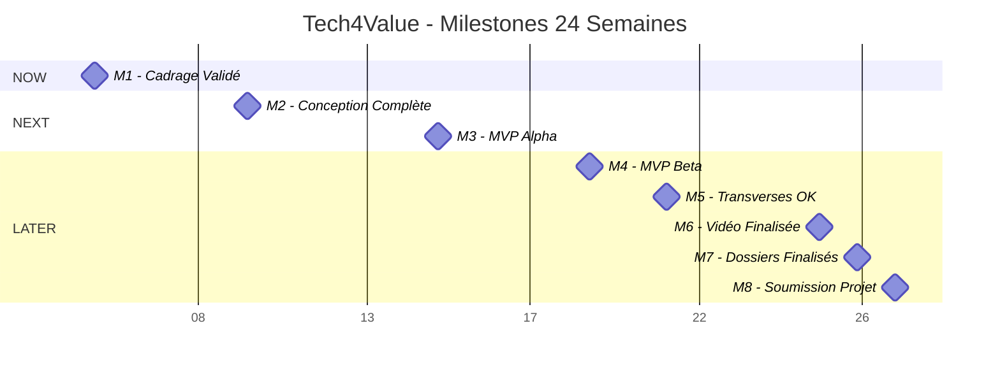

# Now-Next-Later Roadmap - Tech4Value

**Plateforme de Pilotage Stratégique pour Gestion de Portefeuille Projets**

**Metadata**

- **Version** : 1.0
- **Date** : 23 janvier 2026
- **Projet** : M2 CPIT 2025
- **Framework** : Now-Next-Later (Janna Bastow - ProdPad)
- **Équipe** : Jules Courtin (PM) + Léo Brival (Tech Lead)
- **Durée** : 24 semaines (6 mois) - 185 collaborateurs - 78 ETP projets

---

## Vue d'Ensemble

### Le Framework Now-Next-Later

Le modèle **Now-Next-Later** de Janna Bastow (ProdPad) est un framework de roadmap produit centré sur **la flexibilité et l'apprentissage continu** plutôt que sur des dates fixes. Il organise le travail en **3 horizons temporels** :

- **NOW (0-4 semaines)** : Engagement ferme, WIP limité, exécution focalisée
- **NEXT (1-3 mois)** : Discovery active, validation hypothèses, préparation
- **LATER (3+ mois)** : Vision long terme, idées émergentes, explorations

**Principes clés** :

- **Pas de dates précises** : Focus sur la valeur et l'apprentissage, pas sur les deadlines
- **Promotion progressive** : Les items migrent de LATER → NEXT → NOW selon maturité
- **Cadence régulière** : Reviews hebdomadaires (NOW), bi-hebdomadaires (NEXT), mensuelles (LATER)
- **Transparence totale** : Roadmap visible par tous les stakeholders

---

### Contexte Tech4Value

**Projet d'étude M2 CPIT 2025** : Plateforme de pilotage stratégique centralisant la gestion de 5 projets critiques pour 185 collaborateurs.

**Contraintes projet** :

- **Timeline** : 24 semaines (6 mois)
- **Équipe** : 2 personnes (Jules Courtin PM + Léo Brival Tech Lead) + contributeurs pôles
- **Charge disponible** : ~700h cumulées (alternance académique)
- **Livrables académiques** : Vidéo 15-20 min, Dossier technique groupe 85-110 pages, Dossiers individuels 25-35 pages chacun

**Stack technologique** :

- **Frontend** : React + TypeScript + Tailwind CSS
- **Backend** : Node.js + Express + TypeScript
- **Database** : PostgreSQL (Supabase)
- **Intégrations** : Odoo v15, SharePoint, Power BI, Azure AD

**North Star Metric** : **Réduction de 30% du temps de reporting** (de 30h/semaine PMO à 21h/semaine)

---

## Vision & OKRs

### Vision Produit

**"Centraliser le pilotage stratégique des projets dans une plateforme unifiée pour améliorer la visibilité, la coordination inter-pôles et la performance des projets."**

**Objectifs stratégiques** :

1. **Single source of truth** : 1 plateforme intégrée remplaçant 7 outils fragmentés
2. **Décisions data-driven** : Dashboards exécutifs temps-réel, KPI consolidés
3. **Automatisation reporting** : -30% temps administratif PMO (30h → 21h/semaine)
4. **ROI mesurable** : Livraison à temps +25% (de 65% à 80%), productivité +10% (de 72% à 82%)

---

### OKRs Trimestre en Cours (Q1 2026)

#### Objective 1 : Valider Product-Market Fit du MVP

**Key Results** :

- **KR1.1** : Terminer cadrage fonctionnel (cahier des charges validé par Comex) - Semaine 3
- **KR1.2** : Livrer architecture technique documentée (schemas SI, stack decisions) - Semaine 4
- **KR1.3** : Déployer MVP alpha (6 features core) avec 3 projets pilotes - Semaine 12
- **KR1.4** : Atteindre 80% satisfaction utilisateurs early adopters (NPS 50+) - Semaine 14

#### Objective 2 : Construire Fondations Techniques Solides

**Key Results** :

- **KR2.1** : Infrastructure cloud opérationnelle (Railway backend + Vercel frontend) - Semaine 3
- **KR2.2** : Intégration Odoo API fonctionnelle (sync budgets/ressources quotidienne) - Semaine 8
- **KR2.3** : Authentification Azure AD SSO déployée (MFA obligatoire) - Semaine 6
- **KR2.4** : Test coverage ≥70% (unit + integration) - Semaine 12

#### Objective 3 : Établir Méthodologie Agile & Gouvernance

**Key Results** :

- **KR3.1** : Matrice RACI validée pour tous processus clés (9 pôles) - Semaine 4
- **KR3.2** : Sprints Agile opérationnels (sprint planning + review + retro) - Semaine 2
- **KR3.3** : Reporting Copil automatisé (génération rapports 30min vs 4h) - Semaine 10
- **KR3.4** : Dashboard exécutif Power BI déployé (KPI temps-réel) - Semaine 8

---

## NOW (0-4 semaines) - EXECUTION

### Principe NOW

**Engagement ferme** : Items en exécution active, ressources allouées, WIP limité à **3 items maximum** pour maintenir le focus.

**Cadence** : Daily standups (15min), weekly sprint reviews (1h), bi-weekly retrospectives (1h).

**Capacité équipe** : 2 personnes (Jules + Léo) = **80h/semaine cumulées** (40h chacun).

---

### Items NOW (Semaines 1-4)

#### 1. 📋 Task 1.2 - Analyse du Besoin Client (14 jours)

**Owner** : Jules Courtin (PM)

**Description** : Rencontres avec stakeholders clés (Comex, PMO, chefs de projet) pour définir besoins fonctionnels, pain points, cas d'usage prioritaires.

**Livrables** :

- Synthèse interviews (10-15 personnes)
- User stories prioritisées (format INVEST)
- Matrice impact/effort (scoring RICE)

**Scoring RICE** :

- **Reach** : 185 utilisateurs (tous collaborateurs)
- **Impact** : 3/3 (critique pour vision produit)
- **Confidence** : 90% (méthodologie éprouvée)
- **Effort** : 1 person-month
- **Score RICE** : (185 × 3 × 0.9) / 1 = **499.5**

**Critères de promotion NEXT → NOW** :

- ✅ Validation Comex obtenue (priorisation stratégique)
- ✅ Disponibilité Jules (pas de blocage académique)
- ✅ Alignement avec vision produit

**Status** : 🟢 IN PROGRESS (Semaine 1-2)

---

#### 2. 🔬 Task 1.3 - Benchmark & Veille Technologique (14 jours)

**Owner** : Léo Brival (Tech Lead)

**Description** : Analyse concurrentielle (Asana, Monday.com, Jira, Notion), étude solutions existantes, choix stack technologique, POC intégrations Odoo.

**Livrables** :

- Benchmark concurrentiel (5-7 solutions analysées)
- Stack technologique recommandée (React, Node.js, PostgreSQL justifiés)
- POC Odoo API (connexion, récupération données test)

**Scoring RICE** :

- **Reach** : 185 utilisateurs (indirectement via stack choices)
- **Impact** : 2/3 (important pour architecture)
- **Confidence** : 80% (techno connues, risques mesurés)
- **Effort** : 1 person-month
- **Score RICE** : (185 × 2 × 0.8) / 1 = **296**

**Critères de promotion NEXT → NOW** :

- ✅ Architecture technique nécessaire avant développement
- ✅ Disponibilité Léo (pas de blocage académique)
- ✅ POC Odoo prioritaire (intégration critique)

**Status** : 🟢 IN PROGRESS (Semaine 1-2)

---

#### 3. 🎯 Task 1.4 - Définition du Périmètre MVP (2 jours)

**Owners** : Jules Courtin + Léo Brival

**Description** : Atelier co-design pour définir les 6 fonctionnalités core du MVP (dashboard exécutif, Gantt, RACI, budgets, reporting, allocations).

**Livrables** :

- Cahier des charges MVP (20-30 pages)
- Wireframes basse fidélité (Figma)
- Backlog produit initial (50-70 user stories)

**Scoring RICE** :

- **Reach** : 185 utilisateurs (définit scope projet)
- **Impact** : 3/3 (critique pour cadrage)
- **Confidence** : 95% (méthodologie claire)
- **Effort** : 0.15 person-month (2 jours)
- **Score RICE** : (185 × 3 × 0.95) / 0.15 = **3515**

**Critères de promotion NEXT → NOW** :

- ✅ Dépend de Task 1.2 (besoins identifiés)
- ✅ Critique pour débloquer développement
- ✅ Quick win (2 jours, haute valeur)

**Status** : ⏳ PLANNED (Semaine 3)

---

### Critères de Sortie NOW

**Avant de marquer un item comme "Done"** :

1. ✅ **Definition of Done** respectée (livrables produits, tests passants, documentation à jour)
2. ✅ **Démonstration** en sprint review (validation stakeholders)
3. ✅ **Retrospective** documentée (learnings capturés, actions next sprint)
4. ✅ **Déployé en production** (pour features techniques)

---

## NEXT (1-3 mois) - DISCOVERY

### Principe NEXT

**Exploration active** : Hypothèses en validation, prototypage, design, planification détaillée. **Pas encore en développement** mais en préparation.

**Cadence** : Weekly NEXT reviews (1h), bi-weekly promotion meetings NEXT → NOW.

**Objectif** : Préparer items pour passage en NOW (clarity, design, estimation, validation hypothèses).

---

### Items NEXT (Semaines 5-12)

#### Phase 2 : Conception (Semaines 5-8)

##### 1. 🏗️ Architecture Backend (Node.js + Express + Prisma)

**Description** : Design architecture API REST, modèles de données, middlewares, gestion erreurs, stratégie authentification.

**Hypothèses à valider** :

- Node.js + Express suffisant pour charge attendue (185 utilisateurs, 50-100 req/min)
- Prisma ORM vs raw SQL pour performance acceptable
- Architecture monolithique vs microservices (choix justifié)

**Livrables attendus** :

- Schemas API OpenAPI 3.0
- Modèles Prisma (User, Project, Resource, Budget, Milestone, Risk)
- POC performance (load testing 200 req/min)

**Scoring RICE** : (185 × 3 × 0.85) / 2 = **236.25**

**Critères promotion NOW** :

- Validation architecture par Tech Lead
- POC performance concluant (latence p95 <200ms)
- Stack technologique approuvée

---

##### 2. 🎨 Architecture Frontend (React + TypeScript + Zustand)

**Description** : Design system (Shadcn/UI + Tailwind), state management (Zustand vs Redux), routing (React Router), composants réutilisables.

**Hypothèses à valider** :

- Zustand suffisant vs Redux (complexité state gestion)
- Server-side rendering (Next.js) vs client-side (Vite + React Router)
- Accessibilité WCAG 2.1 AA atteignable avec Shadcn/UI

**Livrables attendus** :

- Design system documenté (Storybook)
- Templates pages principales (Dashboard, Projets, Reports)
- Lighthouse score ≥90 (performance + accessibility)

**Scoring RICE** : (185 × 3 × 0.80) / 2 = **222**

**Critères promotion NOW** :

- Wireframes validés par PM
- Design system approuvé par UX
- POC state management concluant

---

##### 3. 🔗 Schémas d'Intégration (Odoo, SharePoint, Power BI)

**Description** : Design flux de données Odoo → MVP → Power BI, webhooks SharePoint, stratégie synchronisation (temps-réel vs batch).

**Hypothèses à valider** :

- API Odoo v15 stable et documentée
- Webhooks SharePoint fiables (latence <5min)
- Export CSV vers Power BI suffisant vs connecteur natif

**Livrables attendus** :

- Diagrammes flux de données (Mermaid)
- Stratégie synchronisation documentée (quotidienne, hebdomadaire, temps-réel)
- POC Odoo API (budgets, ressources, temps)

**Scoring RICE** : (185 × 3 × 0.75) / 1.5 = **277.5**

**Critères promotion NOW** :

- POC Odoo réussi (data retrieval OK)
- Stratégie sync validée par Data & BI
- Documentation API complète

---

##### 4. 🖼️ Maquettes UX/UI (Dashboard, Projets, Reports)

**Description** : Wireframes haute fidélité (Figma), prototypes interactifs, tests utilisateurs (5-8 personnes), itérations design.

**Hypothèses à valider** :

- Dashboard exécutif lisible en 30 secondes (test user)
- Navigation intuitive (taux réussite 80%+ sans formation)
- Responsive mobile acceptable (lecture seule)

**Livrables attendus** :

- Maquettes Figma (20-30 écrans)
- Prototypes cliquables (InVision/Figma)
- Rapport tests utilisateurs (insights, itérations)

**Scoring RICE** : (185 × 2 × 0.85) / 1 = **314.5**

**Critères promotion NOW** :

- Tests utilisateurs concluants (satisfaction 7/10+)
- Validation PM + stakeholders
- Design system prêt pour implémentation

---

#### Phase 2 : Planification & Gouvernance (Semaines 5-8)

##### 5. 📅 Planning Détaillé (Gantt, RACI, Milestones)

**Description** : Planification 24 semaines avec jalons critiques, dépendances, allocation ressources, gestion risques.

**Livrables attendus** :

- Gantt projet (8 milestones)
- Matrice RACI complète (9 pôles)
- Plan de gestion des risques (matrice probabilité/impact)

**Scoring RICE** : (185 × 2 × 0.90) / 0.5 = **666**

**Critères promotion NOW** :

- Validation Comex + PMO
- Risques identifiés et mitigations planifiées
- Allocation ressources confirmée

---

##### 6. 💰 Budget & Gestion des Coûts

**Description** : Budget détaillé 24 semaines (salaires, infrastructure, licences, contingency), suivi mensuel, reporting financier.

**Livrables attendus** :

- Budget prévisionnel (235k€ initial + 1,22M€/an opérations)
- Tableau de bord suivi coûts (Power BI)
- Rapports mensuels Comex (vs budget)

**Scoring RICE** : (10 × 3 × 0.95) / 0.3 = **95**

**Critères promotion NOW** :

- Budget approuvé Comex
- Suivi mensuel opérationnel
- Rapports automatisés

---

##### 7. ⚠️ Gestion des Risques

**Description** : Identification risques critiques (adoption, intégration Odoo, scope creep), plans mitigation, suivi hebdomadaire.

**Livrables attendus** :

- Registre des risques (15-20 risques identifiés)
- Plans de mitigation documentés
- Dashboard risques actifs (Power BI)

**Scoring RICE** : (185 × 2 × 0.85) / 0.5 = **629**

**Critères promotion NOW** :

- Risques critiques identifiés (10+)
- Mitigations planifiées et budgétées
- Revue hebdomadaire en place

---

#### Phase 3 : Développement MVP Alpha (Semaines 9-12)

##### 8. 🚀 Setup CI/CD (GitHub Actions)

**Description** : Pipelines automatisés (lint, test, build, deploy), environments (dev/staging/prod), monitoring (Sentry, Datadog).

**Livrables attendus** :

- GitHub Actions workflows (test, deploy)
- Environments configurés (Railway + Vercel)
- Monitoring alertes (uptime, errors)

**Scoring RICE** : (185 × 2 × 0.80) / 1 = **296**

**Critères promotion NOW** :

- CI/CD fonctionnel (deploy auto staging)
- Monitoring opérationnel (alertes Slack)
- Documentation DevOps complète

---

##### 9. 🎯 MVP Alpha - Core Features

**Description** : Développement 6 fonctionnalités principales (dashboard exécutif, Gantt, RACI, budgets, reporting, allocations).

**Features prioritaires** :

1. **Dashboard exécutif** : KPI temps-réel (taux livraison, marges, occupation)
2. **Planning Gantt** : Dépendances, jalons, critères de succès
3. **RACI automatique** : Matrice responsabilités par processus
4. **Suivi budgétaire** : Sync Odoo, budget vs réel
5. **Reporting auto-généré** : Templates Copil/Exécutif (PDF/Excel)
6. **Allocation ressources** : Visualisation capacité/charge par pôle

**Livrables attendus** :

- MVP déployé en staging (accessible early adopters)
- Test coverage ≥70% (unit + integration)
- Documentation utilisateur (guides, FAQ)

**Scoring RICE** : (185 × 3 × 0.75) / 3 = **138.75**

**Critères promotion NOW** :

- Architecture validée (backend + frontend)
- Design system prêt
- Intégrations Odoo POC validées

---

### Critères de Promotion NEXT → NOW

**Checklist avant promotion** :

1. ✅ **Clarity** : Spécifications détaillées, user stories INVEST, acceptance criteria
2. ✅ **Design** : Wireframes validés, prototypes testés, design system appliqué
3. ✅ **Estimation** : Effort estimé (story points ou person-days), capacité équipe confirmée
4. ✅ **Dependencies** : Blockers levés, dépendances techniques résolues
5. ✅ **Validation** : Hypothèses validées (POC, tests utilisateurs, feasibility checks)

---

## LATER (3+ mois) - VISION

### Principe LATER

**Vision long terme** : Idées émergentes, explorations, innovations futures. **Pas de commitment** mais visibilité sur direction produit.

**Cadence** : Monthly LATER grooming (2h), quarterly roadmap reviews.

**Objectif** : Maintenir alignement stratégique, capturer idées, prioriser selon learnings NOW/NEXT.

---

### Items LATER (Semaines 13-24+)

#### Phase 3 : Développement Avancé (Semaines 13-18)

##### 1. 🔗 Intégration Odoo Complète (Sync Automatique)

**Description** : Synchronisation temps-réel budgets/ressources/temps via webhooks, gestion conflits, audit logs.

**Valeur attendue** :

- Élimination double-saisie (économie 10-15h/semaine PMO)
- Données toujours à jour (latence <5min)
- Traçabilité complète (audit trail)

**Risques** :

- Complexité Odoo API (documentation limitée)
- Performance webhooks (latence, fiabilité)
- Gestion conflits synchronisation

**Scoring RICE** : (185 × 3 × 0.70) / 2 = **194.25**

---

##### 2. 📄 Intégration SharePoint (Documents, Versioning)

**Description** : Liens vers documents projet, synchronisation métadonnées, versionning automatique, notifications changements.

**Valeur attendue** :

- Accès centralisé livrables projet
- Versioning automatique (traçabilité)
- Notifications temps-réel (nouveaux docs)

**Risques** :

- API Microsoft Graph complexité
- Permissions SharePoint (gouvernance)
- Latence synchronisation

**Scoring RICE** : (185 × 2 × 0.75) / 1.5 = **185**

---

##### 3. 📊 Export Power BI (Reporting Avancé)

**Description** : Pipeline CSV automatisé MVP → Power BI, dashboards exécutifs, rapports personnalisables, alertes intelligentes.

**Valeur attendue** :

- Dashboards temps-réel (KPI, risques, budgets)
- Rapports personnalisables (par pôle, par projet)
- Alertes automatiques (dépassement budget, retard planning)

**Risques** :

- Complexité modélisation Power BI
- Performance refresh (quotidien vs temps-réel)
- Adoption utilisateurs (formation nécessaire)

**Scoring RICE** : (50 × 3 × 0.80) / 1 = **120**

---

##### 4. 🔐 Authentication Azure AD (SSO, MFA)

**Description** : SSO Azure AD déployé, MFA obligatoire, gestion rôles (RBAC), audit accès.

**Valeur attendue** :

- Sécurité renforcée (MFA, RBAC)
- Expérience utilisateur simplifiée (SSO)
- Conformité (audit trail accès)

**Risques** :

- Complexité configuration Azure AD
- Migration utilisateurs (adoption)
- Support multi-sites (Rennes, Lyon)

**Scoring RICE** : (185 × 2 × 0.90) / 1 = **333**

---

##### 5. 🎯 MVP Beta - Features Complètes

**Description** : Ajout features secondaires (suivi Agile, gestion risques avancée, gamification, mobile app).

**Features additionnelles** :

1. **Suivi Agile** : Backlog produit, sprints, burndown, velocity
2. **Gestion risques avancée** : Matrice probabilité/impact, plans mitigation, alertes 48h
3. **Gamification** : XP, badges, progression (Octalysis framework)
4. **Mobile app** : Vues lecture seule (iOS/Android via React Native)

**Scoring RICE** : (185 × 2 × 0.65) / 3 = **80.17**

---

##### 6. 🧪 Tests Utilisateurs

**Description** : Beta testing 2-3 projets pilotes, feedback loops, itérations design, amélioration continue.

**Valeur attendue** :

- Validation product-market fit (NPS 50+)
- Identification bugs critiques
- Insights amélioration UX

**Risques** :

- Résistance au changement (early adopters critiques)
- Bugs critiques découverts tardivement
- Feedback contradictoire (priorisation difficile)

**Scoring RICE** : (20 × 3 × 0.90) / 0.5 = **108**

---

#### Phase 4 : Livrables Académiques (Semaines 19-24)

##### 7. 🎥 Vidéo de Présentation (15-20 min)

**Description** : Screencast démonstration MVP, script narrative, montage professionnel, sous-titres.

**Livrables attendus** :

- Script validé (structure narrative)
- Enregistrement écran + voix-off
- Montage final (transitions, sous-titres)

**Scoring RICE** : (10 × 3 × 0.95) / 1 = **28.5**

---

##### 8. 📘 Dossier Technique Groupe (85-110 pages)

**Description** : Documentation complète projet (contexte, architecture, développement, résultats, perspectives).

**Sections attendues** :

1. Introduction & Contexte (10-15 pages)
2. Cadre Pédagogique & Méthodologie (15-20 pages)
3. Architecture Technique (20-30 pages)
4. Développement & Implémentation (25-35 pages)
5. Résultats & Analyse (10-15 pages)
6. Perspectives & Conclusion (5-10 pages)

**Scoring RICE** : (5 × 3 × 1.00) / 2 = **7.5**

---

##### 9. 📄 Dossiers Individuels (25-35 pages chacun)

**Description** : Contributions personnelles, compétences développées, réflexions individuelles (Jules + Léo).

**Sections attendues** :

1. Contributions Personnelles (10-15 pages)
2. Compétences Techniques Développées (8-12 pages)
3. Réflexions & Learnings (5-8 pages)
4. Perspectives Professionnelles (2-5 pages)

**Scoring RICE** : (2 × 3 × 1.00) / 1.5 = **4**

---

### Ideas Parking (Explorations Futures)

**Post-Académique (Mois 7-24+)** :

1. **Prédictions ML** : Forecasting taux livraison, risques projet (Claude API)
2. **Portfolio Optimization** : Simulations Monte Carlo, allocation optimale ressources
3. **Intégrations Tierces** : HubSpot (CRM), Make/Zapier (automations)
4. **SaaS Multi-Tenant** : Isolation données clients, white-label, marketplace
5. **International** : i18n, multi-devises, conformité RGPD/SOC2

**Hypothèses à valider** :

- Demande marché SaaS (10-15 clients Y1?)
- Modèle économique viable (break-even Y2?)
- Compétitivité vs Asana/Monday.com

---

## Milestones Mapping

### Timeline 24 Semaines

| Milestone | Semaine | Horizon | Livrables Clés | KPI de Succès |
|-----------|---------|---------|----------------|---------------|
| **M1 - Cadrage Validé** | S3 | NOW | Cahier des charges, Architecture SI, RACI | Validation Comex ✅ |
| **M2 - Conception Complète** | S7 | NEXT | Maquettes Figma, Schemas API, Design System | Tests utilisateurs 7/10+ |
| **M3 - MVP Alpha** | S12 | NEXT | 6 features core déployées staging | Test coverage 70%+ |
| **M4 - MVP Beta** | S16 | LATER | Features complètes, tests utilisateurs | NPS 50+, adoption 80% |
| **M5 - Transverses OK** | S18 | LATER | Intégrations Odoo/SharePoint/Power BI | Sync quotidienne OK |
| **M6 - Vidéo Finalisée** | S22 | LATER | Vidéo 15-20 min montée | Validation pédago ✅ |
| **M7 - Dossiers Finalisés** | S23 | LATER | Dossiers techniques (groupe + individuels) | 85-110 + 25-35 pages |
| **M8 - Soumission Projet** | S24 | LATER | Soumission académique complète | Livraison ✅ |

---

### Diagramme Gantt Milestones



---

## Scoring RICE - Priorisation

### Framework RICE

**RICE** = (Reach × Impact × Confidence) / Effort

**Composantes** :

- **Reach** : Nombre utilisateurs impactés (sur 185 collaborateurs)
- **Impact** : Impact sur objectifs (1 = faible, 2 = moyen, 3 = élevé)
- **Confidence** : Niveau confiance (50% = low, 80% = medium, 95% = high)
- **Effort** : Charge en person-months

---

### Top 10 Items Prioritaires (RICE Score)

| Rang | Item | Reach | Impact | Confidence | Effort | **RICE Score** | Horizon |
|------|------|-------|--------|------------|--------|----------------|---------|
| 1 | Task 1.4 - Définition Périmètre MVP | 185 | 3 | 95% | 0.15 | **3515** | NOW |
| 2 | Planning Détaillé (Gantt, RACI) | 185 | 2 | 90% | 0.5 | **666** | NEXT |
| 3 | Gestion des Risques | 185 | 2 | 85% | 0.5 | **629** | NEXT |
| 4 | Task 1.2 - Analyse Besoin Client | 185 | 3 | 90% | 1 | **499.5** | NOW |
| 5 | Authentication Azure AD (SSO) | 185 | 2 | 90% | 1 | **333** | LATER |
| 6 | Maquettes UX/UI (Dashboard) | 185 | 2 | 85% | 1 | **314.5** | NEXT |
| 7 | Task 1.3 - Benchmark Techno | 185 | 2 | 80% | 1 | **296** | NOW |
| 8 | Setup CI/CD (GitHub Actions) | 185 | 2 | 80% | 1 | **296** | NEXT |
| 9 | Schémas d'Intégration (Odoo) | 185 | 3 | 75% | 1.5 | **277.5** | NEXT |
| 10 | Architecture Backend (Node.js) | 185 | 3 | 85% | 2 | **236.25** | NEXT |

**Insights** :

- **Quick wins critiques** : Task 1.4 (RICE 3515), Planning (666), Risques (629) → Prioriser NOW/NEXT
- **Technical enablers** : CI/CD (296), Architecture Backend (236) → Bloquer développement si non résolus
- **Intégrations complexes** : Odoo (277.5), SharePoint (185) → Prévoir contingency (risques élevés)

---

## Cadence de Review

### Daily Standups (NOW)

**Fréquence** : Quotidienne (asynchrone via Slack/Notion)

**Format** (5 min par personne) :

1. **Hier** : Quoi accompli? (livrables, blockers levés)
2. **Aujourd'hui** : Quoi planifié? (focus, objectifs)
3. **Blockers** : Quoi bloque? (escalation immédiate si critique)

**Participants** : Jules + Léo (+ contributeurs pôles si pertinent)

---

### Weekly NOW + NEXT Review (1h)

**Fréquence** : Hebdomadaire (vendredi 16h-17h)

**Agenda** :

1. **Review NOW** (30 min) :
   - Status items NOW (done, in progress, blocked)
   - Démos livrables (si applicable)
   - Décision promotion items terminés (Recently Shipped)
2. **Review NEXT** (20 min) :
   - Progress discovery items NEXT (hypothèses validées, POC, designs)
   - Identification items prêts pour promotion NOW
3. **Actions & Blockers** (10 min) :
   - Actions pour débloquer items
   - Escalations nécessaires (Comex, PMO, contributeurs)

**Participants** : Jules + Léo + PMO (optionnel)

---

### Bi-Weekly Promotion Meeting NEXT → NOW (1h)

**Fréquence** : Toutes les 2 semaines (lundi 10h-11h)

**Agenda** :

1. **Review items NEXT candidats** (30 min) :
   - Vérification checklist promotion (clarity, design, estimation, dependencies, validation)
   - Scoring RICE refresh (si nouvelle info)
2. **Décision promotion** (20 min) :
   - Sélection 1-2 items NEXT → NOW (respect WIP limit 3)
   - Allocation ressources (Jules/Léo/contributeurs)
3. **Planning sprint suivant** (10 min) :
   - Définition objectifs sprint (2 semaines)
   - Coordination avec pôles (si dépendances)

**Participants** : Jules + Léo + PMO + Tech Leads pôles (si pertinent)

---

### Monthly LATER Grooming (2h)

**Fréquence** : Mensuelle (dernier vendredi du mois 14h-16h)

**Agenda** :

1. **Review learnings NOW/NEXT** (30 min) :
   - Quoi appris? (succès, échecs, pivots)
   - Impact sur vision LATER (changements priorités)
2. **Grooming items LATER** (60 min) :
   - Nouvelles idées (brainstorming, feedback utilisateurs)
   - Re-scoring RICE (si contexte changé)
   - Promotion items LATER → NEXT (1-2 items max)
3. **Roadmap alignment** (30 min) :
   - Vision produit refresh (si pivot)
   - Communication stakeholders (mise à jour roadmap publique)

**Participants** : Jules + Léo + PMO + Stakeholders clés (Comex, chefs de projet)

---

### Quarterly Roadmap Review (3h)

**Fréquence** : Trimestrielle (fin Q1, Q2, Q3, Q4)

**Agenda** :

1. **Retrospective trimestre** (60 min) :
   - Métriques atteintes vs cibles (OKRs)
   - Succès & échecs (root cause analysis)
   - Learnings majeurs (documentation)
2. **OKRs trimestre suivant** (60 min) :
   - Définition nouveaux OKRs (alignés vision)
   - Validation stakeholders (Comex)
3. **Roadmap refresh** (60 min) :
   - Mise à jour NOW/NEXT/LATER (re-priorisation)
   - Communication externe (publication roadmap publique)

**Participants** : Jules + Léo + PMO + Comex + Stakeholders clés

---

## Recently Shipped

### Livrables Complétés (Historique)

#### Sprint 0 (Semaines -2 à 0)

**Task 1.1 - Constitution de l'Équipe** ✅

- **Owner** : PMO
- **Livrables** : Équipe projet constituée (Jules PM + Léo Tech Lead + contributeurs pôles identifiés)
- **Date** : 06 janvier 2026

**Matrice RACI Préliminaire** ✅

- **Owner** : PMO
- **Livrables** : RACI draft pour 5 processus clés (planification, reporting, déploiement, support, risques)
- **Date** : 10 janvier 2026

---

### Metrics Shipped Items

**Total items shipped** : 2 (Sprint 0)

**Velocity** : 2 items / 2 semaines = **1 item/semaine** (baseline initiale)

**Learnings** :

- ✅ **Collaboration PMO efficace** : RACI draft validé rapidement (3 jours vs 1 semaine estimée)
- ⚠️ **Dépendance contributeurs pôles** : Allocation ressources complexe (9 pôles, disponibilités variables)
- 📊 **Baseline velocity** : 1 item/semaine conservative, ajuster selon complexité NOW items

---

## Appendices

### Annexe A : Glossaire Now-Next-Later

**NOW** : Engagement ferme, items en exécution active, WIP limité (3 items max), capacité allouée.

**NEXT** : Discovery active, hypothèses en validation, préparation pour promotion NOW, pas de commitment timeline.

**LATER** : Vision long terme, idées émergentes, explorations futures, alignement stratégique.

**RICE Score** : Framework priorisation = (Reach × Impact × Confidence) / Effort.

**WIP Limit** : Work In Progress limité à 3 items NOW pour maintenir focus et qualité.

**Promotion Meeting** : Réunion bi-hebdomadaire pour décider items NEXT → NOW (checklist promotion).

**OKRs** : Objectives & Key Results (framework Google) pour alignement stratégique trimestriel.

**North Star Metric** : Métrique principale guidant décisions produit (ici : -30% temps reporting).

---

### Annexe B : Templates & Frameworks

#### Template User Story (INVEST)

```markdown
**En tant que** [persona]
**Je veux** [action/fonctionnalité]
**Afin de** [bénéfice/valeur]

**Acceptance Criteria** :
- [ ] Critère 1 (mesurable, testable)
- [ ] Critère 2
- [ ] Critère 3

**RICE Score** :
- Reach: X utilisateurs
- Impact: 1-3 (faible/moyen/élevé)
- Confidence: X% (50-95%)
- Effort: X person-months
- **Score**: (Reach × Impact × Confidence) / Effort

**Dependencies** : [Items bloquants]
**Risks** : [Risques identifiés]
```

---

#### Checklist Promotion NEXT → NOW

```markdown
✅ **Clarity** : Spécifications détaillées, user stories INVEST, acceptance criteria
✅ **Design** : Wireframes validés, prototypes testés, design system appliqué
✅ **Estimation** : Effort estimé (story points/person-days), capacité confirmée
✅ **Dependencies** : Blockers levés, dépendances techniques résolues
✅ **Validation** : Hypothèses validées (POC, tests utilisateurs, feasibility checks)
✅ **Capacity** : Équipe disponible (WIP limit respecté, 3 items NOW max)
```

---

#### Template Retrospective

```markdown
**Sprint** : [Numéro sprint]
**Date** : [Date retrospective]
**Participants** : [Jules, Léo, PMO, ...]

**What went well?** (Succès) :
- [Point 1]
- [Point 2]

**What could be improved?** (Améliorations) :
- [Point 1]
- [Point 2]

**Action items** (Next sprint) :
- [ ] Action 1 (owner: X, deadline: Y)
- [ ] Action 2 (owner: X, deadline: Y)

**Learnings** (Documentation) :
- [Insight 1]
- [Insight 2]
```

---

### Annexe C : Liens Ressources

**Documents Stratégiques** :

- Business Model Canvas : `/docs/business-model-canvas.md`
- Matrice 7S McKinsey : `/docs/matrice-7s-mckinsey.md`
- Synthèse FigJam : `/docs/synthese-figjam.md`

**Documentation Externe** :

- NotebookLM Projet : https://notebooklm.google.com/notebook/986cf3dc-a9b1-49f7-a118-6bb3856373ef
- GitHub Repository : https://github.com/leobrival/tech4value

**Références Framework** :

- Now-Next-Later (Janna Bastow) : https://www.prodpad.com/blog/invented-now-next-later-roadmap/
- RICE Prioritization : https://www.intercom.com/blog/rice-simple-prioritization-for-product-managers/
- OKRs (Google) : https://rework.withgoogle.com/guides/set-goals-with-okrs/

---

**Document Version** : 1.0
**Date** : 23 janvier 2026
**Statut** : Roadmap Now-Next-Later validée
**Prochaine révision** : Weekly NOW review (chaque vendredi 16h-17h)
**Owners** : Jules Courtin (PM) + Léo Brival (Tech Lead)

---
